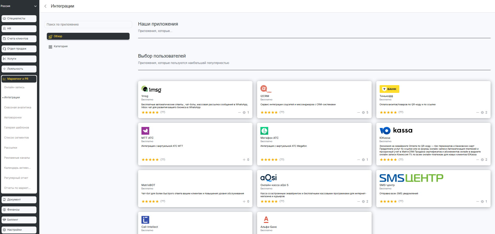

# Интеграции

Как попасть в раздел интеграции?

1. Зайти в сеть.

<figure><figcaption></figcaption></figure>

1. Выбрать Маркетинг и PR.

<figure><figcaption></figcaption></figure>

В этой вкладке вы можете  установить интеграцию с имеющимися сервисами(партнерами).
