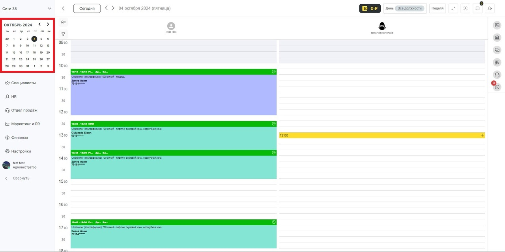

# Работа с записями

После того как **сотрудникам** компании было установлено **расписание**, информация о них появятся в **журнале**. Также появится возможность **записывать клиентов** на услуги к этим сотрудникам.

**Журнал записи** представляет собой электронный календарь, в котором ведется работа с расписанием и визитами. С информацией о визитах клиентов связаны все остальные модули, от программы **лояльности** до **финансового** и **складского учета**. Подробнее о работе с журналом читайте **здесь**.&#x20;

## Создание записи

#### Для создания новой записи:&#x20;

1\. Нажмите на **нужную дату в календаре слева**, откроется расписание на выбранный день.

<figure><figcaption></figcaption></figure>

2\. Выберите **сотрудника** и **время**, на которое нужно записать клиента.&#x20;

Нажмите на кнопку **«Новый сеанс»**, которая появляется при наведении на свободное время в календаре. Укажите вид сеанса: **«Запись»** (индивидуальная) или **«Событие»**. В этой статье мы рассмотрим работу с **индивидуальными записями**, о работе с **групповыми событиями** можно прочитать **здесь**.

<figure><figcaption></figcaption></figure>

При создании новой **индивидуальной записи** автоматически формируется **окно визита**.

<figure><figcaption></figcaption></figure>

**Визит** — это записи одного клиента, которые объединены функцией **«Интервал между уникальными визитами»** (настраивается в разделе **«Настройки» > «Настройки записи» > «Журнал записи»**, подробнее читайте **здесь.**

## Содержание блока визит

* Детали записи.&#x20;
* Статус визита.
* Оплата визита.
* Уведомления.
* История изменений.
* Списание расходов.
* Данные клиента.
* Время проведения услуги.
* Длительность услуги.
* Специалист.

