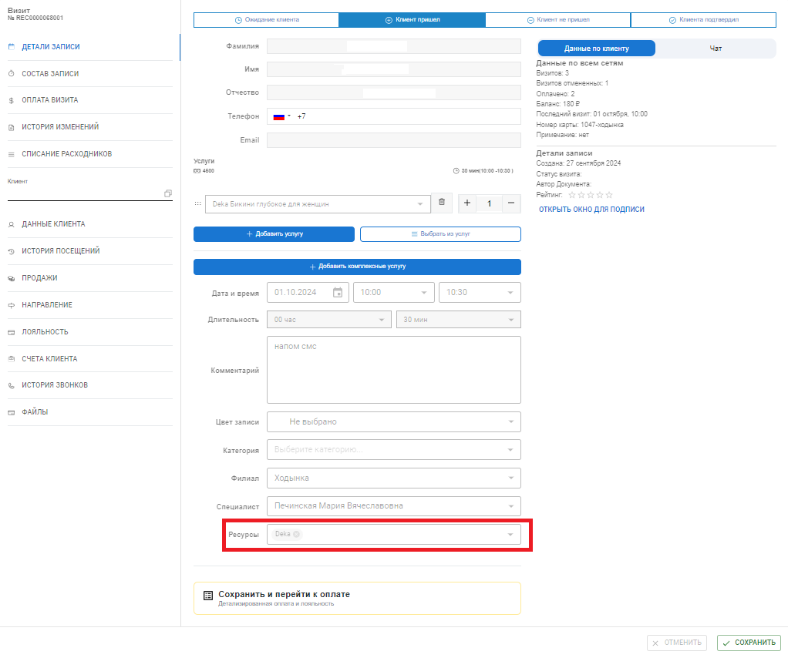

# Работа с ресурсами при записи

Ресурсы бронируются при записи **автоматически**, если они **привязаны к услугам**. При этом, когда клиент самостоятельно записывается онлайн на услугу, к которой привязаны разные ресурсы, по умолчанию бронируется по одному свободному **экземпляру каждого ресурса**.

Когда запись создает администратор, он может выбирать в карточке визита любые **привязанные к услуге ресурсы** и любое имеющееся количество **экземпляров** каждого ресурса.

_Пример ресурсов в окне визита:_

<figure><figcaption></figcaption></figure>

Запись на один и тот же сеанс будет появляться как в **расписании сотрудника**, так и в **расписании экземпляра**.

В режиме **журнала записи по ресурсам** можно быстро просмотреть все занятые ресурсы. Также в этом режиме можно создавать новые записи и события, при создании автоматически будет выбран ресурс, на который создается запись.

## Чтобы посмотреть расписание по ресурсам в журале записи&#x20;

1. Нажмите кнопку просмотра журнала за **день**.
2. В колонке **«Ресурсы»** выберите **все ресурсы** или какой-то конкретный ресурс.

<figure><figcaption></figcaption></figure>

**Чтобы просмотреть расписание экземпляра ресурса в журнале записи за неделю:**

1\. Нажмите на кнопку просмотра журнала за **неделю**.

2\. В колонке **«Ресурсы»** выберите **экземпляр ресурса.** В отличие от просмотра ресурсов за день, для режима «Неделя» можно выбрать только 1 экземпляр.&#x20;

<figure><figcaption></figcaption></figure>

